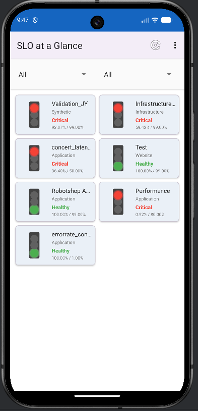
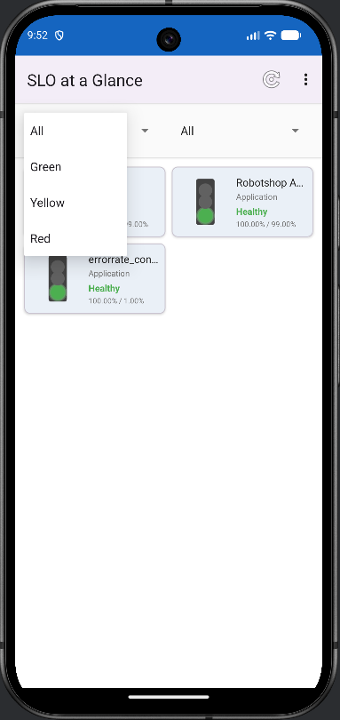
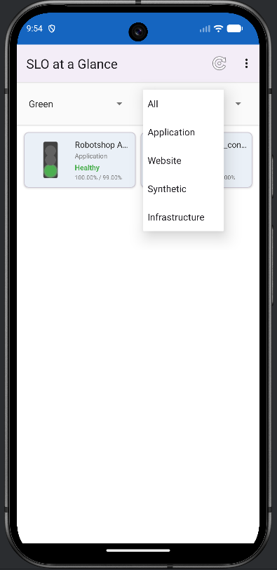
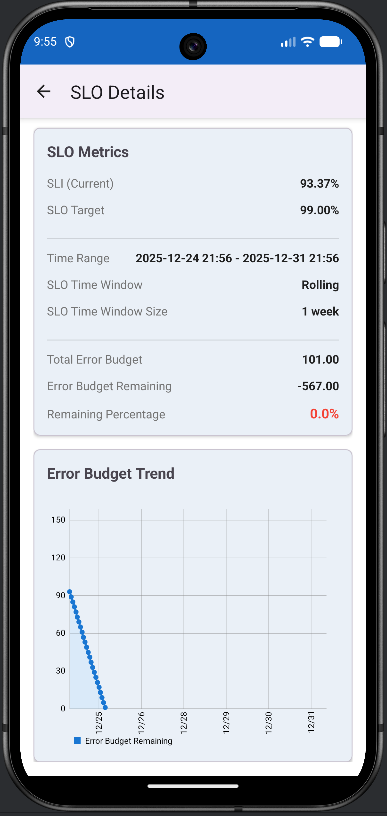

# SLO at a Glance - Project Summary

## Overview
An Android mobile application for monitoring Instana Service Level Objectives (SLOs) with intuitive traffic light visualization (Green/Yellow/Red status indicators).

## Key Features
- 🚦 **Traffic Light Visualization** - Visual status indicators for each SLO
- 📊 **Detailed SLO Reports** - View SLI, SLO targets, error budgets, and trend charts
- 🔍 **Dual Filtering System** - Filter by status and entity type
- ✅ **API Validation** - One-click validation of API connection and credentials
- ⚙️ **Configurable Thresholds** - Customize yellow threshold percentage
- 🔒 **Secure Storage** - Encrypted storage for API credentials
- 🔄 **Pull-to-Refresh** - Easy data refresh with swipe gesture

## Technology Stack
- **Language**: Java
- **Architecture**: MVVM (Model-View-ViewModel)
- **Build System**: Gradle
- **Min SDK**: API 24 (Android 7.0)
- **Target SDK**: API 34 (Android 14)


## Project Structure
```
slo-at-a-glance/
├── slo-mobile/                    # Main application module
│   ├── src/main/
│   │   ├── java/io/instana/slo/  # Package: io.instana.slo
│   │   │   ├── MainActivity.java
│   │   │   ├── data/
│   │   │   │   ├── model/        # Data models (Slo, SloReport, etc.)
│   │   │   │   ├── api/          # Retrofit API service
│   │   │   │   └── repository/   # Repository pattern
│   │   │   ├── ui/
│   │   │   │   ├── slolist/      # SLO list screen
│   │   │   │   ├── slodetail/    # SLO detail screen
│   │   │   │   └── settings/     # Settings screen
│   │   │   └── util/             # Utility classes
│   │   └── res/                  # Resources (layouts, drawables, etc.)
│   └── build.gradle
└── README.md
```

## API Integration
The app connects to Instana API endpoints:
- **SLO List**: `GET /api/settings/slo`
- **SLO Report**: `GET /api/slo/report?sloId={id}`
- **Version (Validation)**: `GET /api/instana/version`

Authentication: `Authorization: apiToken {your-token}`

## Traffic Light Logic
1. 🔴 **RED**: SLI ≤ SLO Target (SLO not being met)
2. 🟡 **YELLOW**: Error budget remaining ≤ Yellow threshold
3. 🟢 **GREEN**: SLO is healthy

## Screenshots
<table>
  <tr>
    <td></td>
    <td></td>
    <td></td>
    <td></td>
  </tr>
</table>
## Build Instructions

### Debug Build
```bash
# Windows
gradlew.bat assembleDebug

# macOS/Linux
./gradlew assembleDebug
```

### Clean Build
```bash
gradlew.bat clean
```

## Configuration
Users configure the app through Settings:
1. **API Endpoint** - Instana API base URL
2. **API Token** - Authentication token
3. **Yellow Threshold** - Error budget percentage for yellow status (default: 50%)
4. **SLO Selection** - Choose which SLOs to display

## Security
- API tokens stored using EncryptedSharedPreferences
- All API communication uses HTTPS

## References
- [Instana API Documentation](https://instana.github.io/openapi/)
- [Instana SLO Capabilities](https://www.ibm.com/docs/en/instana-observability/1.0.310?topic=instana-service-level-objectives-slos)

## License
Developed for Instana API integration demo only.